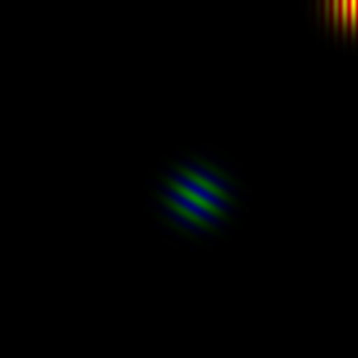

# gabor-noise-fitting-with-pytorch

I implemented Gabor noise renderer with Pytorch. 
You can fit Gabor noise parameters with pytorch autograd framework. 
The rendering code is "gabor_noise_renderer.py" and the fitting (training) code is "gabor_noise_train.py". 
The rendering code have main script and you can use it as rendering only process. 
The renderer will make an image like below.

